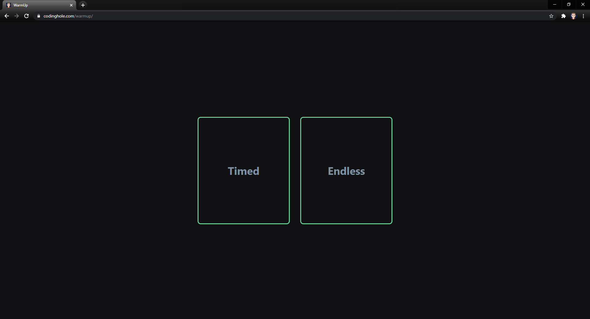
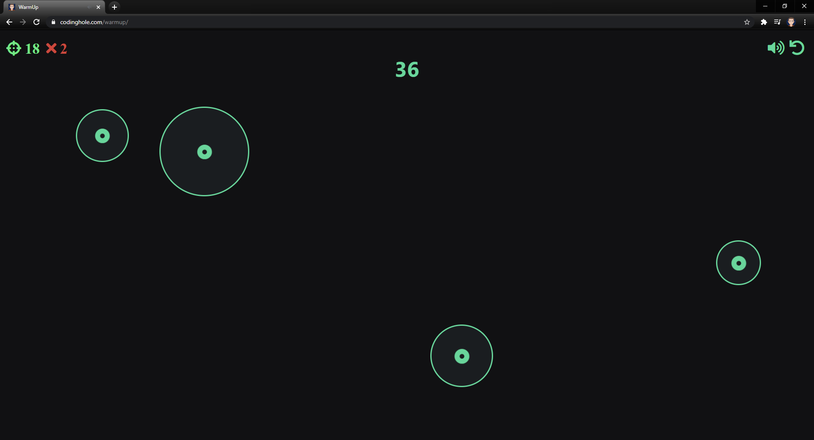
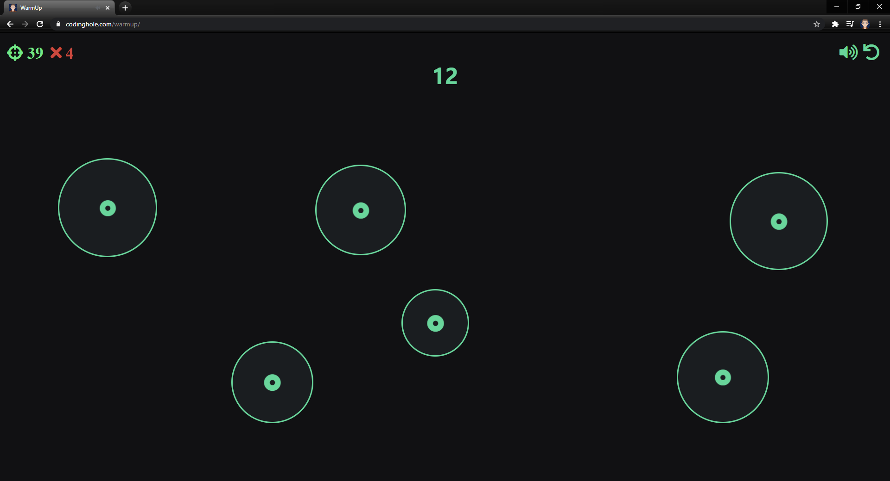
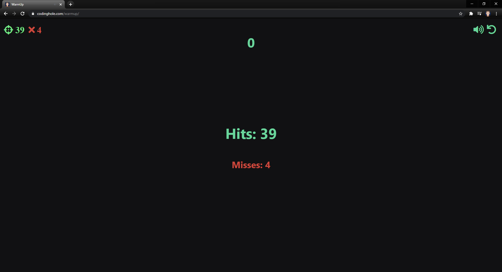

<!-- ABOUT THE PROJECT -->
## About The Project

A short game that will test your aim. If you are into hardcore FPS shooters 
than this will be a great tool for practicing aim. Dive into a fast and responsive environment where
every movement matters. Every miss is counted against you and will be subtracted from the total score.

### Built With

* [HTML](https://www.w3schools.com/html)
* [CSS](https://www.w3schools.com/css)
* [Javascript](https://www.w3schools.com/js)

## How To Play
Go to [codinghole.com/warmup](https://www.codinghole.com/warmup)  
Click on timed and see how many targets you can click
before the time runs out. There is also an endless mode.
